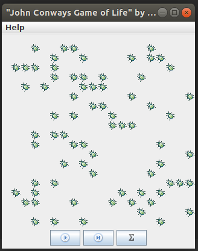
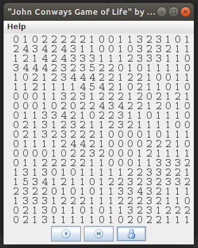

# Conways Life

Imported from my long dead Sourceforge.net account.
They say that when you look at your code from 6 months ago, if you aren't disgusted then you've stopped evolving as a developer.  This code is much older than that and I'm very glad to say that I am beyond disgusted with this code.

So I thought it would be fun to bring it back to life and maybe one day work on it to make it less ugly.

## Implementation

This is a very basic implementation, we have a screen that shows conways life using bug icons.  Nodes can be toggled by clicking and phases can be stepped through or set on a continous step.  

There's also the option of viewing neighbour counts instead of bugs

